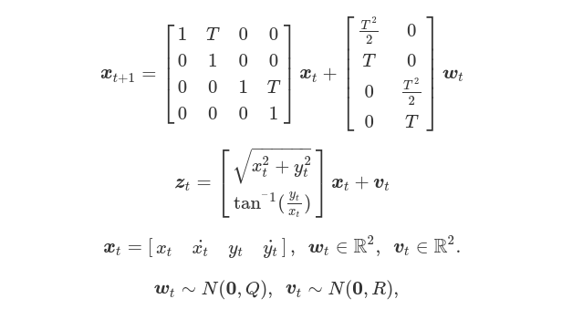

# Nonlinear Filters for a Moving Object 

Implementation of nonlinear filters to estimate a state variable of a moving object in Python3.


* Implemented Filters
  * Particle Filter
  * Unscented Kalman Filter
  * Extended Kalman Filter

<br>

# Installation
```
pip3 install numpy matplotlib
```
<br>


# Model
The object moves with constant velocity [3].


* x : state variable. It's not observed. position and velocity. 
* z : obesrvation variable. distance and angle.
* w : gaussian system noise. 
* v : gaussian observation noise.
* T : sampling period.

The nonlinear filters estimate x from z.

<br>

# Examples

## Particle Filter
```
python3 main.py --filter pf --num_particles 300 
```


The initial point [x_0, y_0] is set [-100, 50] and the number of particles is set 300 by default.
The figure is saved in the "result" directory. Fix the seed of random numbers in reproducing.

<br>

## Unscented Kalman Filter
```
python3 main.py --filter ukf --kappa 0 --decompose cholesky
```

<br>

## Extended Kalman Filter
```
python3 main.py --filter ekf 
```

In the EKF, estimated values are occasionally disterbed due to linearlization error.


<br>

# Evaluation
* Mean position error between measurements and estimated values [m]

  | Seed | PF (300) | UKF | EKF |
  | --- | --- | --- | ---|
  | 1  |   3.22   |   2.98   | **2.95** |
  | 2  |   4.46   |   3.50   | **3.44** |
  | 3  |   2.69   | **2.58** |   13.23  |
  | 4  |   3.74   |   3.77   | **3.66** |
  | 5  |   3.24   | **2.96** |   2.99   |
  | 6  | **3.10** |   3.11   |   3.12   |
  | 7  |   4.28   |   3.61   | **3.50** |
  | 8  |   2.69   |   2.62   | **2.48** |
  | 9  |   3.60   |   3.49   | **3.40** |
  | 10 |   2.95   | **2.76** |   12.95  |
<br>

* Mean processing time to estimate [msec]

  | Seed | PF (300) | UKF | EKF |
  | --- | --- | --- | ---|
  | 1  | 3.02 |   0.57   | **0.38** |
  | 2  | 2.83 |   0.55   | **0.38** |
  | 3  | 2.93 |   0.74   | **0.38** |
  | 4  | 2.91 |   0.55   | **0.38** |
  | 5  | 2.89 |   0.54   | **0.38** |
  | 6  | 2.82 |   0.54   | **0.40** |
  | 7  | 2.88 |   0.55   | **0.38** |
  | 8  | 3.01 |   0.60   | **0.38** |
  | 9  | 2.88 |   0.54   | **0.38** |
  | 10 | 3.05 |   0.54   | **0.38** |

On the whole, the UKF shows good performance in terms of precision and processing time against this model.

<br>

# References
1. Dan Simon : Optimal State Estimation: Kalman, H Infinity, and Nonlinear Approaches. 

2. Tohru Katayuama : Non-linear Kalman Filter．

3. I. Arasaratnam, et al. : Discrete-Time Nonlinear Filtering Algorithms using Gauss-Hermite Quadrature, Proc. IEEE, Vol.95, No.5, pp.953-977(2007)