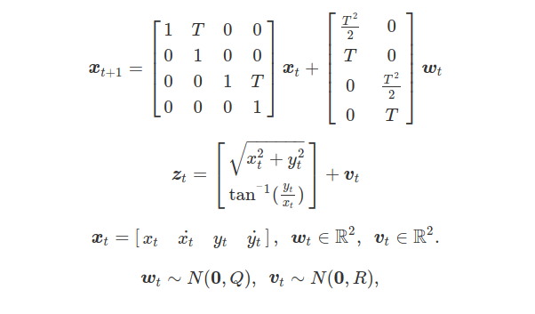
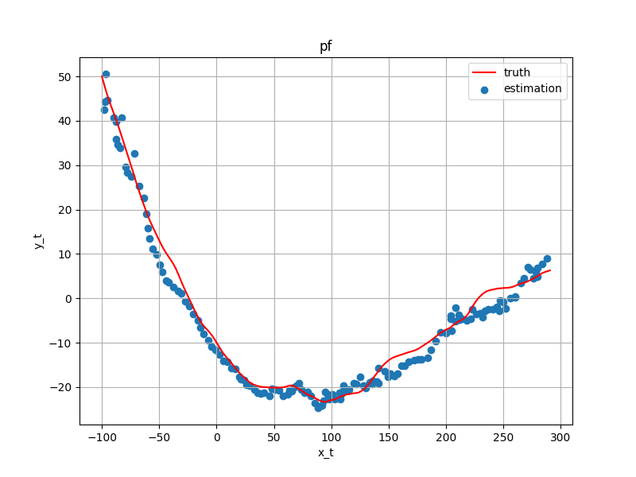

# Nonlinear Filters for a Moving Object 

Implementation of nonlinear filters to estimate a state variable of a moving object in Python3.


* Implemented Filters
  * Particle Filter
  * Unscented Kalman Filter
  * Extended Kalman Filter

<br>

# Installation
```
pip3 install numpy matplotlib
```
<br>


# Model
The object moves with constant velocity [3].


* x : state variable. It's not observed. position and velocity. 
* z : obesrvation variable. distance and angle.
* w : gaussian system noise. 
* v : gaussian observation noise.
* T : sampling period.

The nonlinear filters estimate x from z.

<br>

# Examples

## Particle Filter
```
python3 main.py --filter pf --num_particles 300 
```



The initial point [x_0, y_0] is set [-100, 50] and the number of particles is set 300 by default.
The figure is saved in the "result" directory. Fix the seed of random numbers in reproducing.

<br>

## Unscented Kalman Filter
```
python3 main.py --filter ukf --kappa 0 --decompose cholesky
```

<br>

## Extended Kalman Filter
```
python3 main.py --filter ekf 
```

In the EKF, estimated values are occasionally disterbed due to linearlization error.


<br>

# Evaluation
* Mean position error between measurements and estimated values [m]

  | Seed | PF (300) | UKF | EKF |
  | --- | --- | --- | ---|
  | 1  |   3.64   |   2.86    |   13.02   |
  | 2  |   3.71   | **3.526** |   3.527   |
  | 3  |   2.99   | **2.70**  |   2.71    |
  | 4  |   4.31   |   3.723   | **3.716** |
  | 5  |   3.09   |   2.93    | **2.92**  |
  | 6  | **3.12** |   3.302   | **3.297** |
  | 7  |   3.94   | **3.51**  |   3.52    |
  | 8  |   2.66   | **2.59**  |   2.61    |
  | 9  |   5.09   |   3.62    | **3.55**  |
  | 10 |   2.83   | **2.74**  |   13.05   |
<br>

* Mean processing time to estimate [msec]

  | Seed | PF (300) | UKF | EKF |
  | --- | --- | --- | ---|
  | 1  | 2.76 |   0.50   | **0.36** |
  | 2  | 2.90 |   0.54   | **0.37** |
  | 3  | 2.96 |   0.54   | **0.37** |
  | 4  | 2.85 |   0.53   | **0.36** |
  | 5  | 3.06 |   0.59   | **0.36** |
  | 6  | 3.03 |   0.54   | **0.36** |
  | 7  | 2.93 |   0.53   | **0.37** |
  | 8  | 2.89 |   0.53   | **0.36** |
  | 9  | 2.82 |   0.54   | **0.37** |
  | 10 | 3.00 |   0.73   | **0.36** |

On the whole, the UKF shows good performance in terms of precision and processing time against this model.

<br>

# References
1. Dan Simon : Optimal State Estimation: Kalman, H Infinity, and Nonlinear Approaches. 

2. Tohru Katayuama : Non-linear Kalman Filter．

3. I. Arasaratnam, et al. : Discrete-Time Nonlinear Filtering Algorithms using Gauss-Hermite Quadrature, Proc. IEEE, Vol.95, No.5, pp.953-977(2007)